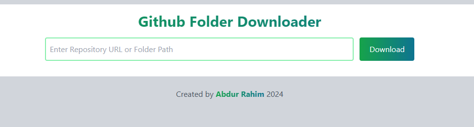
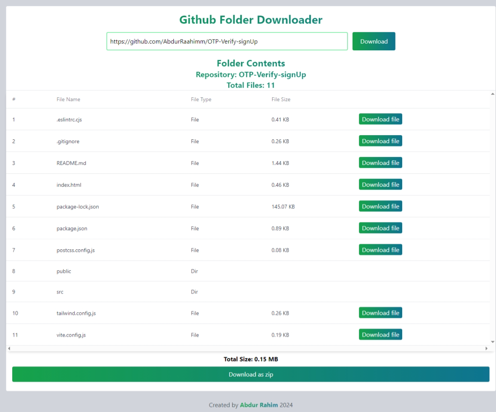
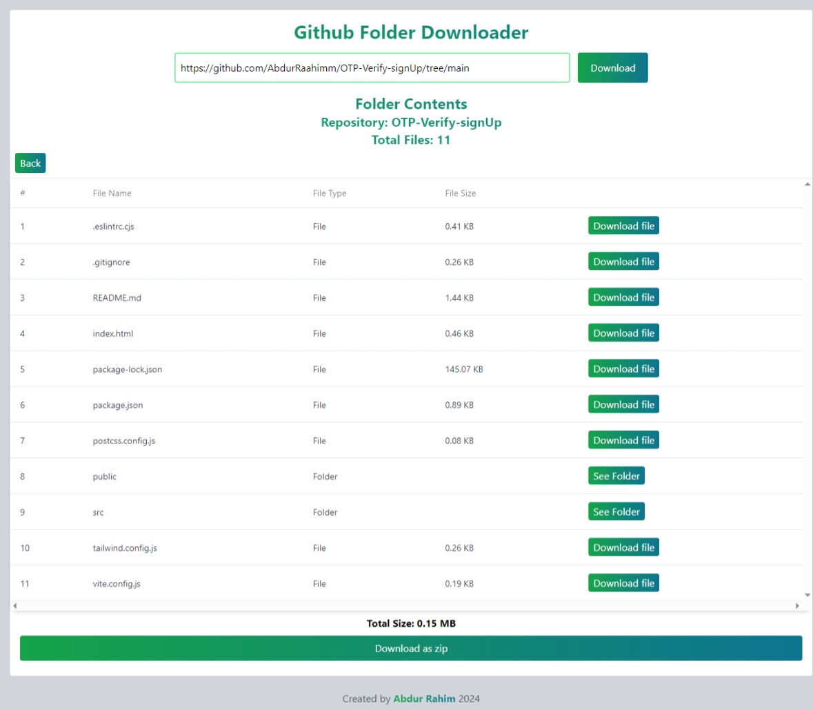

# Github Folder Downloader 

This is a simple javascript project to download a folder from a github repository.

## How to use

1. Open the folder you want to download in your browser.
2. Copy the URL from the address bar.
3. Paste the URL in the input field and click the "Download" button.
4. Wait for the download to start.

## How it uses in local 

1. Clone the repository.
```bash
git clone https://github.com/AbdurRaahimm/github-folder-downloader.git
```
2. go to the folder.
```bash
cd github-folder-downloader
```
3. Open the vscode or any other code editor.
```bash
code .
```
4. start the live server on vscode.
5. Open the browser and go to the live server URL.
6. Follow the steps above.

## Features 

- Download a github repository.
- Download a folder from a github repository.
- Download a single file from a github repository.
- See Folder and file structure.
- Download the folder as a zip file.
- See Folder Details.
- Add back Button to go back to the previous folder.

## Technologies Used

- HTML
- Tailwind CSS
- JavaScript
- jsZip library

## Screenshots 




## Live Demo 

[Live Demo](https://abdurraahimm.github.io/github-folder-downloader/)


## Author
- [Twitter](https://twitter.com/AbdurRahim4G)
- [Instagram](https://www.instagram.com/abdurrahim4g/)
- [Facebook](https://www.facebook.com/Rahim72446)
- [LinkedIn](https://www.linkedin.com/in/abdur-rahim4g/)
- [YouTube](https://youtube.com/@AbdurRahimm)